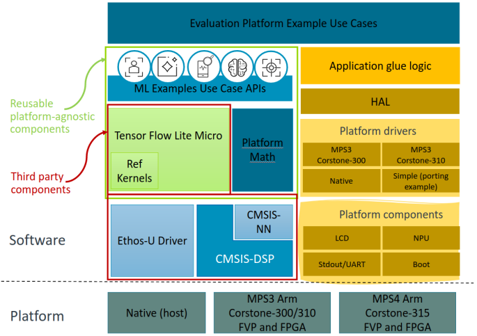

# Arm® ML embedded evaluation kit

This repository is for building and deploying Machine Learning (ML) applications targeted for Arm® Cortex®-M and Arm®
Ethos™-U NPU.
To run evaluations using this software, we suggest using an [MPS3 board](https://developer.arm.com/tools-and-software/development-boards/fpga-prototyping-boards/mps3)
or a fixed virtual platform (FVP) that supports Ethos-U55 software fast model. Both environments run a combination of
the new [Arm® Cortex™-M55 processor](https://www.arm.com/products/silicon-ip-cpu/cortex-m/cortex-m55) and the
[Arm® Ethos™-U55 NPU](https://www.arm.com/products/silicon-ip-cpu/ethos/ethos-u55).

## Overview of the evaluation kit

The purpose of the evaluation kit is to allow the user to develop software and test the performance of the Ethos-U55 NPU and
Cortex-M55 CPU. The Ethos-U55 NPU is a new class of machine learning(ML) processor, specifically designed to accelerate
computation for ML workloads in constrained embedded and IoT devices. The product is optimized to execute
mathematical operations efficiently that are commonly used in ML algorithms, such as convolutions or activation functions.

## ML use cases

The evaluation kit adds value by providing ready to use ML applications for the embedded stack. As a result, you can
experiment with the already developed software use cases and create your own applications for Cortex-M CPU and Ethos-U NPU.
The example application at your disposal and the utilized models are listed in the table below.

|   ML application                     |  Description | Neural Network Model |
| :----------------------------------: | :-----------------------------------------------------: | :----: |
|  [Image classification](./docs/use_cases/img_class.md)              | Recognize the presence of objects in a given image | [Mobilenet V2](https://github.com/ARM-software/ML-zoo/blob/master/models/image_classification/mobilenet_v2_1.0_224/tflite_uint8)   |
|  [Keyword spotting(KWS)](./docs/use_cases/kws.md)             | Recognize the presence of a key word in a recording | [DS-CNN-L](https://github.com/ARM-software/ML-zoo/blob/master/models/keyword_spotting/ds_cnn_large/tflite_clustered_int8) |
|  [Automated Speech Recognition(ASR)](./docs/use_cases/asr.md) | Transcribe words in a recording | [Wav2Letter](https://github.com/ARM-software/ML-zoo/blob/master/models/speech_recognition/wav2letter/tflite_int8) |
|  [KWS and ASR](./docs/use_cases/kws_asr.md) | Utilise Cortex-M and Ethos-U to transcribe words in a recording after a keyword was spotted | [DS-CNN-L](https://github.com/ARM-software/ML-zoo/blob/master/models/keyword_spotting/ds_cnn_large/tflite_clustered_int8)  [Wav2Letter](https://github.com/ARM-software/ML-zoo/blob/master/models/speech_recognition/wav2letter/tflite_int8) |
|  [Anomaly Detection](./docs/use_cases/ad.md)                 | Detecting abnormal behavior based on a sound recording of a machine | Coming soon|
| [Generic inference runner](./docs/use_cases/inference_runner.md) | Code block allowing you to develop your own use case for Ethos-U55 NPU | Your custom model |

The above use cases implement end-to-end ML flow including data pre-processing and post-processing. They will allow you
to investigate embedded software stack, evaluate performance of the networks running on Cortex-M55 CPU and Ethos-U55 NPU
by displaying different performance metrics such as inference cycle count estimation and results of the network execution.

## Software and hardware overview

The evaluation kit is based on the [Arm® Corstone™-300 reference package](https://developer.arm.com/ip-products/subsystem/corstone/corstone-300).
Arm® Corstone™-300 helps you build SoCs quickly on the Arm® Cortex™-M55 and Arm® Ethos™-U55 designs. Arm® Corstone™-300 design
implementation is publicly available on an [Arm MPS3 FPGA board](https://developer.arm.com/tools-and-software/development-boards/fpga-prototyping-boards/download-fpga-images),
or as a [Fixed Virtual Platform of the MPS3 development board](https://developer.arm.com/tools-and-software/open-source-software/arm-platforms-software/arm-ecosystem-fvps).

The Ethos-U NPU software stack is described [here](https://developer.arm.com/documentation/101888/0500/NPU-software-overview/NPU-software-components?lang=en).

All ML use cases, albeit illustrating a different application, have common code such as initializing the Hardware
Abstraction Layer (HAL). The application common code can be run on x86 or Arm Cortex-M architecture thanks to the HAL.
For the ML application-specific part, Google® TensorFlow™ Lite for Microcontrollers inference engine is used to schedule
the neural networks models executions. TensorFlow Lite for Microcontrollers is integrated with the [Ethos-U55 driver](https://git.mlplatform.org/ml/ethos-u/ethos-u-core-driver.git)
and delegates execution of certain operators to the NPU or, if the neural network model operators are not supported on
NPU, to the CPU. [CMSIS-NN](https://github.com/ARM-software/CMSIS_5) is used to optimise CPU workload execution
with int8 data type.
Common ML application functions will help you to focus on implementing logic of your custom ML use case: you can modify
only the use case code and leave all other components unchanged. Supplied build system will discover new ML application
code and automatically include it into compilation flow.

To run an ML application on the Cortex-M and Ethos-U55 NPU, please, follow these steps:

1. Setup your environment by installing [the required prerequisites](./docs/sections/building.md#Build-prerequisites).
2. Generate an optimized neural network model for Ethos-U with a Vela compiler by following instructions [here](./docs/sections/building.md#Add-custom-model).
3. [Configure the build system](./docs/sections/building.md#Build-process).
4. [Compile the project](./docs/sections/building.md#Building-the-configured-project) with a `make` command.
5. If using a FVP, [launch the desired application on the FVP](./docs/sections/deployment.md#Fixed-Virtual-Platform).
If using the FPGA option, load the image on the FPGA and [launch the application](./docs/sections/deployment.md#MPS3-board).

To get familiar with these steps, you can follow the [quick start guide](docs/quick_start.md).

For more details:

- [Arm Ethos-U55 NPU Code Samples](docs/documentation.md)
  - [Trademarks](docs/documentation.md#Trademarks)
  - [Prerequisites](docs/documentation.md#Prerequisites)
    - [Additional reading](docs/documentation.md#additional-reading)
  - [Repository structure](docs/documentation.md#repository-structure)
  - [Building](docs/documentation.md#building)
  - [Deployment](docs/documentation.md#deployment)
  - [Running sample applications](docs/documentation.md#running-code-samples-applications)
  - [Implementing custom ML application](docs/documentation.md#implementing-custom-ML-application)
  - [Testing and benchmarking](docs/documentation.md#testing-and-benchmarking)
  - [Troubleshooting](docs/documentation.md#troubleshooting)
  - [Appendix](docs/documentation.md#appendix)
  - [Contribution guidelines](docs/documentation.md#contribution-guidelines)
    - [Coding standards and guidelines](docs/documentation.md#coding-standards-and-guidelines)
    - [Code Reviews](docs/documentation.md#code-reviews)
    - [Testing](docs/documentation.md#testing)
  - [Communications](docs/documentation.md#communications)
  - [Licenses](docs/documentation.md#licenses)

