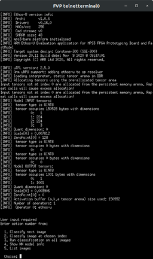

# Running Ethos-U55 Code Samples

## Contents

- [Starting Fast Model simulation](#starting-fast-model-simulation)

This section covers the process for getting started with pre-built binaries for the Code Samples.

## Starting Fast Model simulation

Once built application binaries and assuming the install location of the FVP
was set to ~/FVP_install_location, the simulation can be started by:

```commandline
FVP_install_location/models/Linux64_GCC-6.4/FVP_Corstone_SSE-300_Ethos-U55
./bin/mps3-sse-300/ethos-u-<use_case>.axf
```

This will start the Fast Model simulation for the chosen use-case.

A log output should appear on the terminal:

```log
telnetterminal0: Listening for serial connection on port 5000
telnetterminal1: Listening for serial connection on port 5001
telnetterminal2: Listening for serial connection on port 5002
telnetterminal5: Listening for serial connection on port 5003
```

This will also launch a telnet window with the sample application's
standard output and error log entries containing information about the
pre-built application version, TensorFlow Lite Micro library version
used, data type as well as the input and output tensor sizes of the
model compiled into the executable binary.




> **Note:**
For details on the specific use-case follow the instructions in the corresponding documentation.

Next section of the documentation: [Implementing custom ML application](../documentation.md#Implementing-custom-ML-application).
